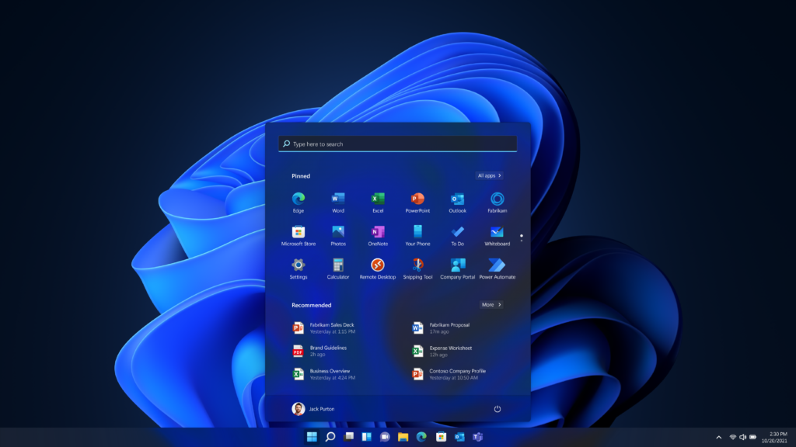
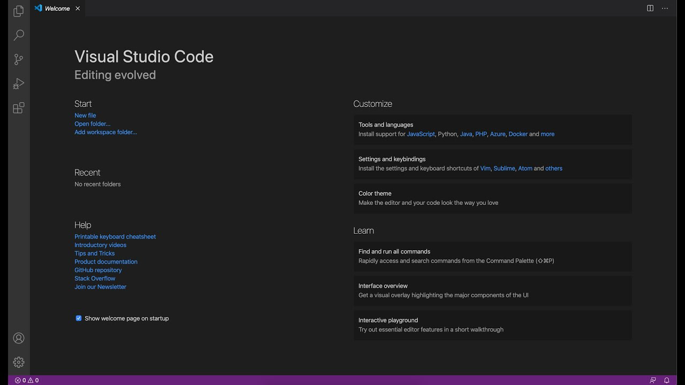
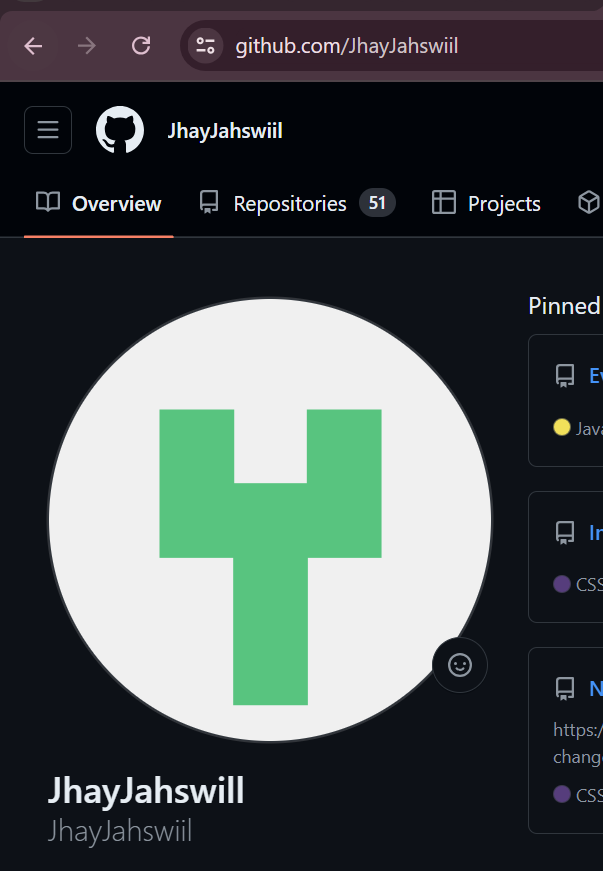
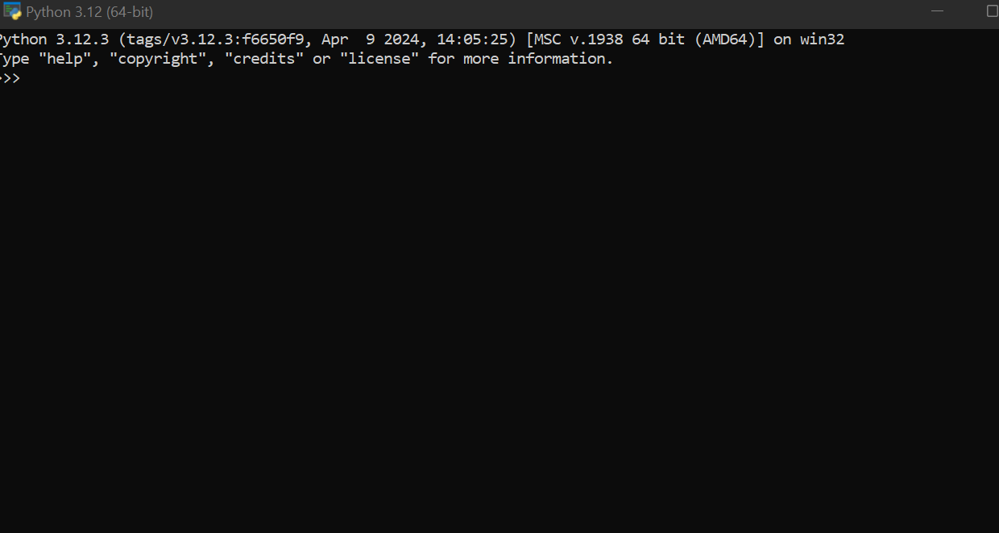
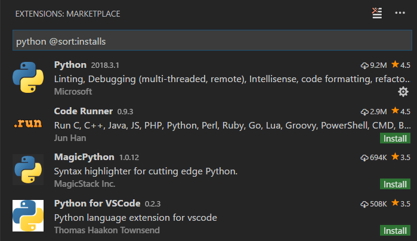

# Developer Environment Setup

## Operating System
- **Installed Windows 11**:
  

## Text Editor/IDE
- **Installed Visual Studio Code**:
  

## Version Control System
- **Installed Git and Configured**:
  
- **Created GitHub Account**:
  

## Programming Languages and Runtimes
- **Installed Python**:
  

## Extensions and Plugins
- **Installed VS Code Extensions**:
  

## Challenges and Solutions
- **Challenge**: Initial Git setup issues
  **Solution**: Referred to Git documentation and Stack Overflow for troubleshooting steps.

## GitHub Repository
- **Link**: [https://github.com/JhayJahswiil]
